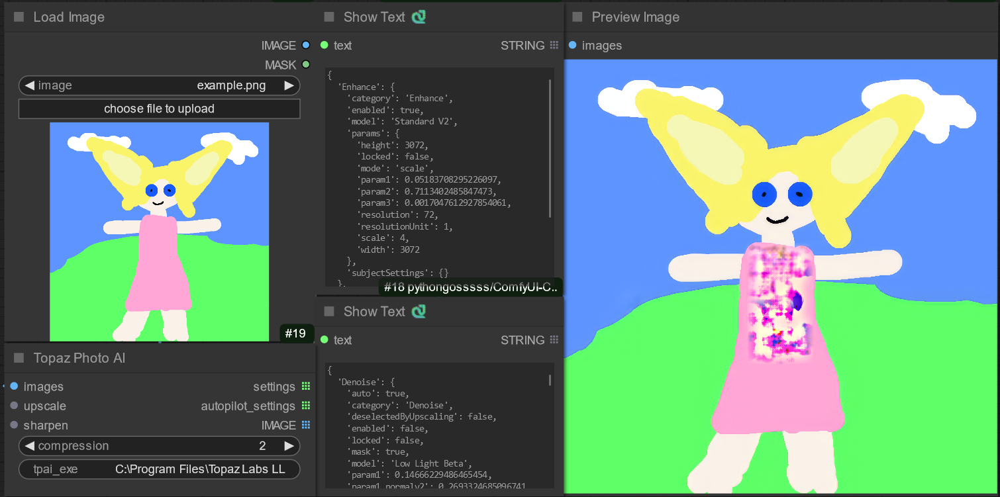
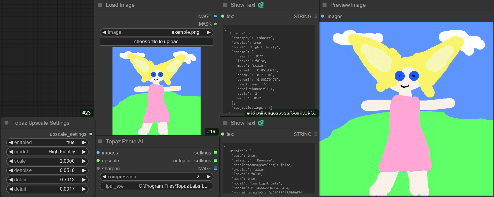

# What is Comfy-Topaz?
Comfy-Topaz is a custom node for ComfyUI, which integrates with Topaz Photo AI to enhance (upscale, sharpen, denoise, etc.) images, allowing this traditionally asynchronous step to become a part of ComfyUI workflows.

# Requirements
- Licensed installation of [Topaz Photo AI](https://www.topazlabs.com/downloads): This provides `tpai.exe`, the path to which should be set for the `Topaz Photo AI (tpai.exe)` setting in ComfyUI.

# Installation
Clone this repo into `ComfyUI/custom_nodes` and restart ComfyUI.

# Usage
## Auto-Pilot Settings
This is the simplest use case, which relies on Topaz Photo AI to auto-detect and apply those settings. This is done by omitting the `upscale` and `sharpen` settings as inputs:

Sometimes auto-pilot settings don't yield the best results, which warrants manual tuning.

On the output side, `autopilot_settings` shows what the auto-pilot settings were, and `settings` shows all the features used and knobs turned to generate the final image.

## Manual Settings
Override auto-pilot settings by providing manual settings:

A good starting point is by copying over params from auto-pilot from which to iterate. I copied over the `denoise`, `deblur`, and `detail` values and changed the model from `Standard V2` to `High Fidelity`.

# TODO
- Output `*Settings` nodes rather than json, to eliminate the manual steps of copying values when overriding settings.
- Add a button to run auto-pilot analysis without applying the settings on the image.
- Map `param1`, `param2`, `param3`, ... to the actual param name (e.g., `denoise`, `deblur`, and `detail` for Upscale Settings)
- Expose more settings (denoise, face recovery, text recovery, WB/exposure adjustment).